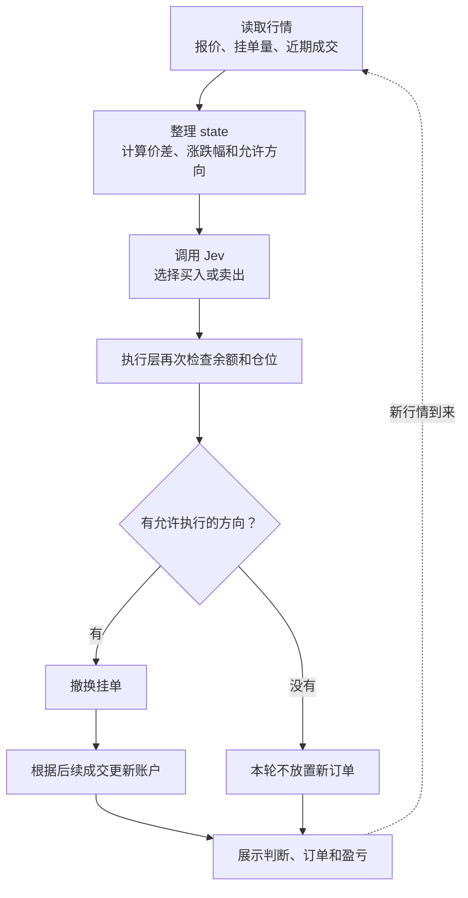
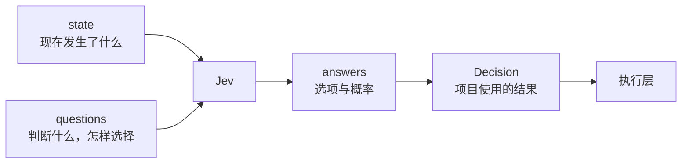

# Jev 如何驱动交易：从行情到订单

一个自动交易程序，需要不断重复三个动作：看行情、作判断、处理订单。

在 jev-trader 里，Jev 负责中间的判断。程序把行情整理好，问它更适合买还是卖，再根据回答和账户限制处理挂单。

本文沿着这条流程，介绍业务逻辑、Prompt 设计和接口参数。代码中的字段均附中文注释。

> 以下描述当前实现。Hyperliquid 使用 HYPE/USDC 真实现货行情和模拟账户；Kuru 保留链上订单代码，但当前页面入口只启动模拟会话。本文不把它描述成已经完成的合约交易系统。

## 一、业务流程：模型回答以后，才轮到执行

订单簿是还没有成交的买卖报价清单。程序读取订单簿和近期成交，将它们转换成模型能直接使用的数据。



*图 1：主业务流程。Hyperliquid 路径中的订单与成交均为模拟。*

这里有三个不同的时刻：**模型作出选择、程序放置订单、订单真正成交。**

例如，Jev 选择买入，程序就考虑挂一张买单。挂单只是报价，还要有人愿意卖给你，才会成交。当前策略偏向 post-only，也就是只挂在订单簿上，不立即吃掉对手方报价。

模型不直接决定订单数量，也不签名或操作钱包。执行层根据预设规则计算订单。如果模型选择的方向受余额或仓位限制，当前代码可能改用另一侧；两侧都不允许时，就不放置新订单。

## 二、接口结构：材料、问题、答案

Jev 的接口可以理解成做选择题。你提供材料和选项，它返回选择结果。



*图 2：模型返回的是判断，交易程序继续负责执行。*

`state` 和 `questions` 是接口结构；`mid`、`trades`、`allowed` 等名字，是这个项目自己设计的业务字段。[TypeSafe 接口文档](https://docs.typesafe.ai/api)

先看模型配置：

```dotenv
# 使用 Jev；项目默认 mock 是本地模拟模型，不请求 Jev。
MODEL=jev

# 服务端认证密钥，由 provider 读取，不放入行情或调用记录。
TYPESAFE_AI_API_KEY=你的_API_密钥

# 请求的模型名称，项目默认使用这个别名。
JEV_MODEL_ID=jev-latest
```

模型配置与交易模式是两件事。调用真实 Jev，也可以只做模拟交易。

项目通过 AI SDK 调用模型。下面保留调用结构，`state` 和 `QUESTIONS` 在后文解释：

```ts
import { experimental_evaluate } from "ai";
import { typeSafeAi } from "@ai-sdk/typesafe-ai";

// 实际项目读取 config.jevModelId，这里展示默认值。
const model = typeSafeAi.evaluationModel("jev-latest");

// 固定本次材料，避免异步等待期间原对象变化。
const input = structuredClone({
  state,                 // 本次行情和允许方向。
  questions: QUESTIONS,  // 本次问题集合。
});

const result = await experimental_evaluate({
  model,                       // provider 创建的模型实例，不是字符串。
  state: input.state,          // 交给模型判断的业务数据。
  questions: input.questions,  // 问题说明与候选答案。
  maxRetries: 0,               // 禁用 SDK 自动重试，避免在旧行情上反复请求。
});
```

`maxRetries: 0` 不是超时设置。这段调用没有设置取消信号，不能理解成超过一个区块时间就自动终止。

## 三、state：给模型看什么？

输入主要回答四件事：交易哪个市场、看多长时间、市场目前怎样、哪些方向允许执行。

下面完整列出当前 `TradeState`，包括嵌套字段。价格使用计价资产，数量使用基础资产；1 bps 是 0.01%。`?` 表示类型允许省略，`null` 表示没有可用值。

```ts
interface TradeState {
  market: string;       // 市场名称，例如 MON-USDC 或 HYPE-USDC。
  venue?: string;       // 交易场所；当前填写 Kuru 或 hyperliquid。
  baseAsset?: string;   // 基础资产，如 MON、HYPE，也是数量单位。
  quoteAsset?: string;  // 计价资产，如 USDC，也是价格的计价单位。

  block: number;          // Kuru 为链上区块号；Hyperliquid 为本地事件序号。
  horizonBlocks: number;  // 向前判断多少个观察单位，不是下单间隔。
  blockMs: number;        // 每个观察单位的名义时长，毫秒。
  mid: number;            // 中间价 =（最优买价 + 最优卖价）/ 2。
  spreadBps: number;      // 价差 =（最优卖价 - 最优买价）/ mid × 10000。
  bookImbalance: number;  // 中间价上下 1% 内，（买量 - 卖量）/（买量 + 卖量）。

  depth: {                // 各价格范围内的累计挂单数量。
    [band: string]: {     // 范围键名；当前统计 10、25、50 bps。
      bid: number;       // 该范围内累计买单量，单位为基础资产。
      ask: number;       // 该范围内累计卖单量，单位为基础资产。
    };
  };

  book: {                // 最优附近的订单簿，每侧最多 5 档。
    bids: string[];      // 买盘，最好报价在前，元素为“价格 x 数量”。
    asks: string[];      // 卖盘，最好报价在前，元素为“价格 x 数量”。
  };

  returnsBps: {          // 相对历史价格的变化，单位 bps。
    last1: number;       // 相对前 1 个已记录价格样本。
    last5: number;       // 相对前 5 个已记录价格样本。
    last20: number;      // 相对前 20 个已记录价格样本。
    last100: number;     // 相对前 100 个已记录价格样本。
  };

  recentMids: string;    // 从旧到新的中间价，用空格连接，采样规则见下表。

  trades: {             // 近期整个市场的主动成交统计，不是本策略的成交。
    count: number;      // 窗口内保留的成交记录条数。
    buyMon: number;     // 主动买入量，实际单位为 baseAsset。
    sellMon: number;    // 主动卖出量，实际单位为 baseAsset。
    cvdMon: number;     // buyMon - sellMon，可为负，仅统计当前窗口。
    vwap: number | null;       // 成交量加权均价；无有效成交量时为 null。
    lastPrice: number | null;  // 窗口内最后成交价；无记录时为 null。
    lastSide: "buy" | "sell" | null; // 最后成交的主动方方向；无记录时为 null。
  };

  recentTrades: string[]; // 最近最多 10 条成交，从旧到新；格式见下表。

  allowed: {             // 程序算出的方向许可，执行前仍需检查。
    buy: boolean;        // 当前是否允许放置一笔买单。
    sell: boolean;       // 当前是否允许放置一笔卖单。
  };
}
```

举例来说，买一价为 99.9、卖一价为 100.1，那么 `mid = 100`，`spreadBps = 20`。

如果近期主动买入 12 HYPE、主动卖出 8 HYPE，那么 `cvdMon = 4`。这里沿用了 Mon 的旧名称，实际表示 4 HYPE。

`bookImbalance` 表达买卖挂单量的偏向。它等于 0.5，不表示上涨概率为 50%。

两个市场复用了字段，但采样口径有区别：

| 参数 | Kuru | Hyperliquid |
| --- | --- | --- |
| `horizonBlocks × blockMs` | 默认 100 × 300ms，约 30 秒 | 30 × 1000ms，约 30 秒 |
| `depth` 键名 | 如 `"10bps"` | 如 `"10"`，单位同样是 bps |
| `recentMids` | 最近 H 个样本中每 5 个取一个，包含最新值 | 最近最多 30 个样本 |
| `trades` 窗口 | 最近 H 个区块内保留的成交 | 最近 30 秒内保留的成交 |
| `recentTrades` | 最近 10 条记录，开头是区块号 | 最近 30 秒内最多 10 条，开头是毫秒时间戳 |
| 收益率历史不足 | 对应 `returnsBps` 值填 0 | 与最早保留的样本比较 |

H 指 `horizonBlocks`。成交摘要的其余格式是“buy或sell 数量 @ 价格”。样本可能因断线或处理延迟而不等间隔，因此“前 20 个样本”不能直接当成“20 秒前”。

## 四、Prompt 设计：把任务说具体

如果只问“现在应该买还是卖”，模型不知道你准备持有多久，也不知道订单怎样成交。

当前 Prompt 把这些信息拆开：判断目标、预测窗口、成交方式、参考材料和可选动作。

下面保留实际字段结构，将英文说明精简翻译成中文。它用于解释设计，不是源码原文。

```ts
const QUESTIONS = {
  direction: {             // 自定义问题名，答案通过 answers.direction 读取。
    type: "choice",        // 选择题，从 criteria 的选项中选择。

    instructions: {        // 问题背景；内部键名是项目自行定义的。
      question:            // 具体判断：指定观察窗口后，价格高于还是低于当前 mid？
        "经过 horizonBlocks 个观察单位后，基础资产价格会高于还是低于当前中间价？",

      goal:                // 业务用途：选择挂单方向，考虑成本、不利价格变化和库存限制。
        "为 venue 的 market 选择 post-only 挂单方向，预测窗口约为 horizonBlocks × blockMs 毫秒，并考虑价差、费用和仓位约束。",

      timing:              // 成交方式：挂单等待别人来成交，可能先被替换。
        "订单等待主动方成交或被替换。挂单不保证成交，也不是立即执行的市价单。",

      inputs:              // 重点材料与硬约束；两侧都不允许时，执行层不放新单。
        "参考 trades.cvdMon、trades.lastSide、recentTrades、depth、book、returnsBps 和 recentMids，并遵守 allowed。",
    },

    criteria: {            // 候选答案及其判断标准。
      buy:                 // 买入方向：偏向上涨，避免刚成交就下跌。
        "挂买单，判断未来价格偏强，并遵守 allowed.buy。",

      sell:                // 卖出方向：偏向下跌，避免卖出后立即上涨。
        "挂卖单，判断未来价格偏弱，并遵守 allowed.sell。",
    },
  },
} as const;
```

这种设计把“预测什么”和“怎样使用预测”放在同一个问题里。模型既看到价格方向任务，也知道自己是在为一张等待成交的限价单选择方向。

但有两点要准确理解。

第一，当前只有 `buy`、`sell` 两个候选答案，没有主动观望选项。程序中的 `hold` 不能直接解读成 Jev 选择了观望。

第二，Prompt 虽然要求考虑费用，当前 `state` 并没有提供明确费率，也没有完整仓位盈亏。写进说明，不等于已经给模型提供了对应数据。

## 五、返回值：怎样变成交易程序的决定？

下面是项目读取或保存的 SDK 业务字段，不包含响应头等传输信息。

```ts
interface UsedSdkResult {
  answers: {                    // 按请求的问题名组织答案。
    direction: {                // 对应 questions.direction。
      type: "choice";           // 答案类型，与请求一致。
      choice: "buy" | "sell";    // 模型选中的方向。
      probabilities?: {         // 当前安装的 SDK 类型允许概率缺失。
        buy: number;            // 买入选项概率，正常取值 0 到 1。
        sell: number;           // 卖出选项概率，正常情况下与 buy 相加为 1。
      };
    };
  };

  usage: {                      // token 用量，不是费用金额。
    inputTokens: number | undefined;   // 输入量，项目用它估算模型成本。
    outputTokens: number | undefined;  // 输出量，当前未单独用于费用估算。
    totalTokens: number | undefined;   // 总量，未单独复制进 Decision。
  };
}
```

SDK 将 HTTP 用量字段 `input_tokens`、`output_tokens` 转成上述驼峰名称。官方 HTTP 文档还描述了 `confidence`，但当前安装的 SDK Choice 类型未暴露它，项目也没有读取它。[返回值说明](https://docs.typesafe.ai/api)

接着，项目把答案整理成自己的结果类型，并保留调用记录：

```ts
interface Decision {
  action: "buy" | "sell" | "hold"; // Jev 初始为 buy 或 sell；执行层可能调整。
  probabilities: {              // 整理后的概率分布。
    buy: number;                // 买入概率；缺失的单个选项补 0。
    sell: number;               // 卖出概率；缺失的单个选项补 0。
    hold: number;               // JevModel 的正常结果固定填 0。
  };
  upIn10: number;                // 旧字段名，实际等于 buy 概率，不是另一次预测。
  latencyMs: number;             // 本地测得的模型调用耗时，含请求等待，不含下单。
  inputTokens: number;           // 输入 token 数，缺失时补 0，不代表实际免费。
  trace?: ModelTrace;            // 本次输入输出记录，用于审查。
}

interface ModelTrace {
  source: "jev" | "simulation";  // 判断来自 Jev 或 MockModel，不表示是否实盘。
  model: string;                // 配置的模型名称，如 jev-latest 或 mock。
  input: {                      // 调用前固定的输入快照。
    state: TradeState;          // 本次市场材料，字段见前文。
    questions?: unknown;        // 本次问题集合；MockModel 不填写。
  };
  output: unknown;              // Jev 保存 { answers, usage }，字段见 UsedSdkResult；
                                // MockModel 保存模拟 Decision，不含 trace。
}
```

如果 SDK 完全没返回概率，当前代码把选中项补成 1，其他项补成 0。此时看到的 100% 是程序补值，不能当作模型的真实确定程度。

即使模型确实返回了 `buy: 0.7`，也只能先理解为买入选项的概率。**它不自动等于交易胜率。** 成交价格、退出时机和成本都会影响结果。

## 六、把一次判断串起来

假设 Jev 返回买入，买入概率为 0.7。

程序接着检查余额和仓位。如果买入允许，就按执行规则报价；如果买入受限而卖出允许，当前代码可能改挂卖单。订单中的 `capped` 字段会标记这种方向调整。

所以，审查时要区分三份记录：

- `trace.output`：模型原本选择了什么。
- 最终订单：程序实际准备执行什么。
- 成交记录：市场最终成交了什么。

目前 Jev 接口只负责第一部分。订单执行和账户更新由代码负责，模型调用记录则让这条链路可以被核对。

文章依据当前工作区的 [model.ts](/Users/liyu/AI/ai-jev/jev-trader/src/model.ts)、[trader.ts](/Users/liyu/AI/ai-jev/jev-trader/src/trader.ts)、[hyperliquid.ts](/Users/liyu/AI/ai-jev/jev-trader/src/hyperliquid.ts)及本地 SDK 类型定义整理。代码块是字段说明，不是一份可直接启动交易的完整脚本。
